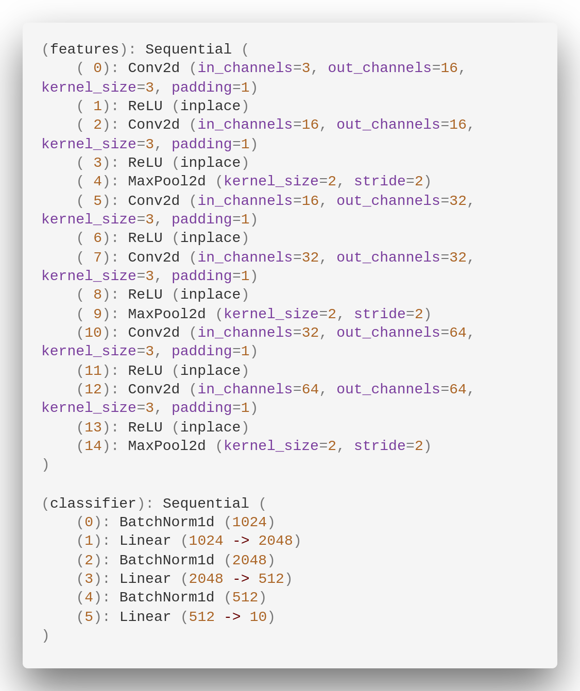

# Configuration
- NVIDIA Tesla K80
- CUDA-8.0
- PyTorch-0.4.0

# Overview

Parameter|v1|v2|v3
---|---|---|---
batch_size|100|100
epochs|100|300|300
eta|1e-2|1e-2| (1e-1, 1e-2, 1e-3) (100 epochs each)
normalize|Yes|Yes|Yes
train_time|~18 mins|~55 mins|~ 55 mins
train_accuracy|100%|93%|96.73%
test_error|29.96%|25.47%|23.9%

# Achitecture
## 1. v1

